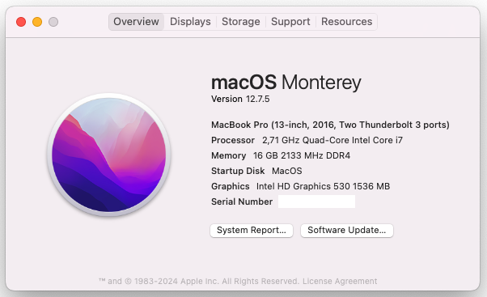

# INSTALL MACOS MONTERY 12.7 ON HP ZBOOK 15 G3

This repository contains the necessary files and information to successfully boot macOS on this laptop. 

- Bootloader version: **OpenCore 1.0.0**
- SMBIOS: [MacBookPro13,1]
- Kexts version: everything up-to-date with the latest version
- macOS version: [Monterey 12.7](https://www.apple.com/macos/monterey)

## Specs

| Component         | Brand                                     |
|-------------------|-------------------------------------------|
| **CPU**           |  Intel Core i7-6820hq @ 2.7 GHz           |
| **iGPU**          |  Intel HD530 - Sky Lake                   |
| **RAM**           |  16GB SODIMM 2166MHz                      |
| **Storage**       |  Sandisk 256GB                            |
| **Audio**         |  Realtek ALC236 - layout-id 13            |
| **WiFi/BT Card**  |  Intel AX210                              |
| **OS**            |  macOS Monterey 12.7.2                    |
| **BIOS**          |  B81                                      |

## Credits

* [Apple](https://apple.com) for macOS
* [Acidanthera](https://github.com/Acidanthera) for OpenCore and Lilu-based kexts 
* [dreamwhite](https://github.com/dreamwhite) for helping me to fix the I2C trackpad and with SSDT/ACPI hotpatching
* [OpenIntelWireless](https://github.com/OpenIntelWireless/itlwm) for Intel Wifi Card driver
* [Gengik84](https://www.macos86.it/profile/1-gengik84/) for introducing us the `GENG` method used in SSDT-USB.aml
* [dortania](https://github.com/dortania) team for its detailed guides